# HCMC Metro

## Phần 1. Giới thiệu và mô tả chức năng hệ thống

### 1.1. Giới thiệu dự án
HCMC Metro là hệ thống web hỗ trợ tra cứu, trải nghiệm và quản trị dịch vụ Metro TP.HCM. Dự án được xây dựng theo mô hình fullstack với:

- `Frontend`: Next.js, React, TypeScript, Tailwind CSS
- `Backend`: Django, Django REST Framework
- `Database`: PostgreSQL
- `Cache`: Redis
- `Message Broker / Background Jobs`: RabbitMQ, Celery

Hệ thống phục vụ đồng thời 2 nhóm người dùng:

- `Người dùng cuối`: tra cứu thông tin Metro, đặt vé, theo dõi vé, gửi góp ý, xem tin tức và tiện ích
- `Quản trị viên`: quản lý dữ liệu vận hành, người dùng, tin tức, vé, doanh thu và phản hồi khách hàng

### 1.2. Chức năng chính của hệ thống

#### A. Chức năng dành cho người dùng

1. `Đăng ký / Đăng nhập`
- Đăng ký tài khoản bằng email
- Xác thực email bằng OTP
- Đăng nhập bằng email/mật khẩu
- Đăng nhập bằng Google
- Quên mật khẩu và đặt lại mật khẩu

2. `Tra cứu thông tin Metro`
- Xem bản đồ số Metro
- Xem tuyến, ga và lộ trình di chuyển
- Theo dõi thông tin liên quan đến hệ thống Metro

3. `Đặt vé và thanh toán`
- Chọn loại vé
- Thực hiện quy trình đặt vé
- Thanh toán vé
- Xem trạng thái thanh toán và kết quả đặt vé

4. `Quản lý tài khoản cá nhân`
- Xem thông tin hồ sơ
- Xem vé đang hoạt động
- Xem lịch sử vé
- Cập nhật thông tin cá nhân
- Đổi mật khẩu

5. `Tiện ích và tin tức`
- Xem danh sách tiện ích trong hệ thống Metro
- Xem chi tiết từng tiện ích
- Đọc danh sách tin tức
- Xem chi tiết bài viết tin tức

6. `Góp ý và phản hồi`
- Gửi góp ý về trải nghiệm, cơ sở vật chất hoặc lỗi hệ thống
- Theo dõi trạng thái xử lý góp ý trong trang cá nhân

7. `Chatbox hỗ trợ`
- Hỗ trợ người dùng tra cứu thông tin liên quan đến Metro

#### B. Chức năng dành cho quản trị viên

1. `Dashboard quản trị`
- Xem thống kê tổng quan về hệ thống
- Theo dõi một số chỉ số hoạt động

2. `Quản lý người dùng`
- Xem danh sách người dùng
- Theo dõi thông tin tài khoản

3. `Quản lý hệ thống Metro`
- Quản lý dữ liệu tuyến, ga, tàu và thành phần liên quan

4. `Quản lý trạm bus và tiện ích`
- Quản lý trạm bus liên kết với ga Metro
- Quản lý dữ liệu tiện ích

5. `Quản lý vé và doanh thu`
- Theo dõi vé đã bán
- Kiểm tra trạng thái vé
- Xem dữ liệu doanh thu

6. `Quản lý tin tức`
- Tạo, cập nhật, hiển thị và quản lý bài viết tin tức

7. `Quản lý góp ý khách hàng`
- Xem danh sách góp ý từ người dùng
- Cập nhật trạng thái xử lý góp ý

### 1.3. Kiến trúc triển khai
Dự án được tổ chức theo 2 thư mục chính:

- `frontend/`: giao diện người dùng và admin
- `backend/`: API, xử lý nghiệp vụ, xác thực, thanh toán, tác vụ nền

Ngoài ra hệ thống còn sử dụng:

- `database/schema.sql`: khởi tạo dữ liệu cơ sở dữ liệu
- `docker-compose.yml`: cấu hình chạy toàn bộ hệ thống bằng Docker

#### Sơ đồ kiến trúc tổng quan

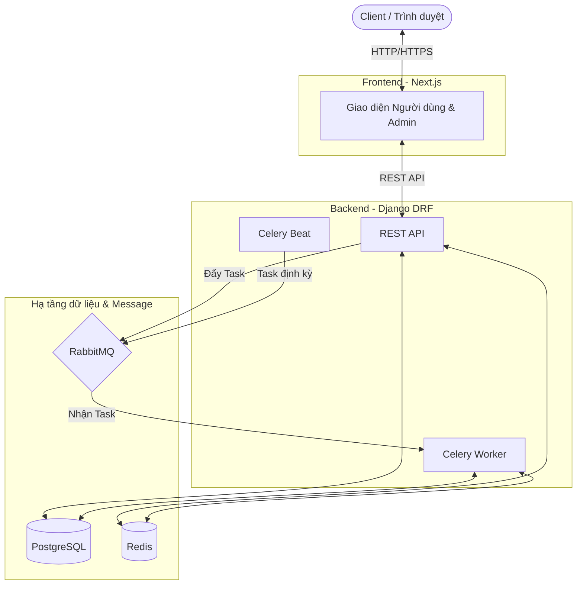
```mermaid
graph TD
    Client([Client / Trình duyệt])
    
    subgraph Frontend [Frontend - Next.js]
        WebUI[Giao diện Người dùng & Admin]
    end
    
    subgraph Backend [Backend - Django DRF]
        API[REST API]
        Worker[Celery Worker]
        Beat[Celery Beat]
    end
    
    subgraph Infrastructure [Hạ tầng dữ liệu & Message]
        DB[(PostgreSQL)]
        Cache[(Redis)]
        MQ{RabbitMQ}
    end
    
    Client <-->|HTTP/HTTPS| WebUI
    WebUI <-->|REST API| API
    
    API <--> DB
    API <--> Cache
    
    API -->|Đẩy Task| MQ
    Beat -->|Task định kỳ| MQ
    MQ -->|Nhận Task| Worker
    Worker <--> DB
    Worker <--> Cache
```

---

## Phần 2. Hướng dẫn clone và chạy project

### 2.1. Yêu cầu môi trường
Trước khi chạy project, cần cài đặt:

- `Git`
- `Docker`
- `Docker Compose`

Khuyến nghị:

- RAM tối thiểu `8 GB`
- Docker Desktop đã được bật trước khi chạy

### 2.2. Clone source code
Chạy các lệnh sau:

```bash
git clone <link-repository>
cd HCMC-Metro
```

Nếu bạn đã có repository trên máy thì chỉ cần di chuyển vào thư mục project:

```bash
cd HCMC-Metro
```

### 2.3. Cấu hình biến môi trường
Project sử dụng file `.env` ở thư mục gốc để cấu hình cho Docker, backend và frontend.

Bạn cần kiểm tra hoặc bổ sung các biến quan trọng như:

```env
DB_NAME=
DB_USER=
DB_PASSWORD=
PGADMIN_DEFAULT_EMAIL=
PGADMIN_DEFAULT_PASSWORD=

SECRET_KEY=

GOOGLE_CLIENT_ID=
GOOGLE_CLIENT_SECRET=
NEXT_PUBLIC_GOOGLE_CLIENT_ID=

EMAIL_HOST=
EMAIL_PORT=
EMAIL_HOST_USER=
EMAIL_HOST_PASSWORD=
DEFAULT_FROM_EMAIL=

PAYOS_CLIENT_ID=
PAYOS_API_KEY=
PAYOS_CHECKSUM_KEY=

GROQ_API_KEY=
```

Lưu ý:

- `backend` đọc biến môi trường từ `.env`
- `frontend` cũng sử dụng một phần biến môi trường từ `.env`
- Nếu dùng đăng nhập Google thì cần cấu hình `GOOGLE_CLIENT_ID` và `NEXT_PUBLIC_GOOGLE_CLIENT_ID`

### 2.4. Chạy project bằng Docker Compose
Từ thư mục gốc của project, chạy:

```bash
docker compose up --build
```

Lệnh trên sẽ khởi động các service:

- `db`: PostgreSQL
- `redis`: Redis
- `rabbitmq`: RabbitMQ
- `pgadmin`: giao diện quản trị PostgreSQL
- `backend`: Django API
- `frontend`: Next.js app
- `celery_worker`: xử lý task nền
- `celery_beat`: chạy scheduler cho task định kỳ

### 2.5. Truy cập hệ thống sau khi chạy
Sau khi chạy thành công, có thể truy cập:

- `Frontend`: http://localhost:3000
- `Backend API`: http://localhost:8000
- `pgAdmin`: http://localhost:5050
- `RabbitMQ Management`: http://localhost:15672

### 2.6. Một số lệnh hữu ích

1. `Chạy nền`

```bash
docker compose up -d
```

2. `Dừng hệ thống`

```bash
docker compose down
```

3. `Xem log`

```bash
docker compose logs -f
```

4. `Chỉ xem log backend`

```bash
docker compose logs -f backend
```

5. `Chạy migration`

```bash
docker compose exec backend python manage.py migrate
```

6. `Tạo tài khoản admin`

```bash
docker compose exec backend python manage.py createsuperuser
```

### 2.7. Kiểm tra nhanh sau khi khởi động
Sau khi hệ thống lên, có thể kiểm tra nhanh:

1. Mở `http://localhost:3000` để kiểm tra giao diện frontend
2. Mở `http://localhost:8000` để kiểm tra backend đang hoạt động
3. Kiểm tra đăng ký / đăng nhập
4. Kiểm tra các trang admin nếu đã có tài khoản quản trị

### 2.8. Cấu trúc thư mục chính

```text
HCMC-Metro/
├─ backend/              # Django + DRF backend
├─ frontend/             # Next.js frontend
├─ database/             # SQL khởi tạo dữ liệu
├─ docker-compose.yml    # Cấu hình chạy toàn bộ hệ thống
├─ .env                  # Biến môi trường
└─ README.md
```

### 2.9. Ghi chú

- Frontend mặc định chạy ở cổng `3000`
- Backend mặc định chạy ở cổng `8000`
- Project ưu tiên chạy bằng Docker để tránh lỗi khác biệt môi trường
- Nếu thay đổi `.env`, nên chạy lại:

```bash
docker compose up --build
```

---

## Phần 3. Giao diện hệ thống

- **Trang chủ:**
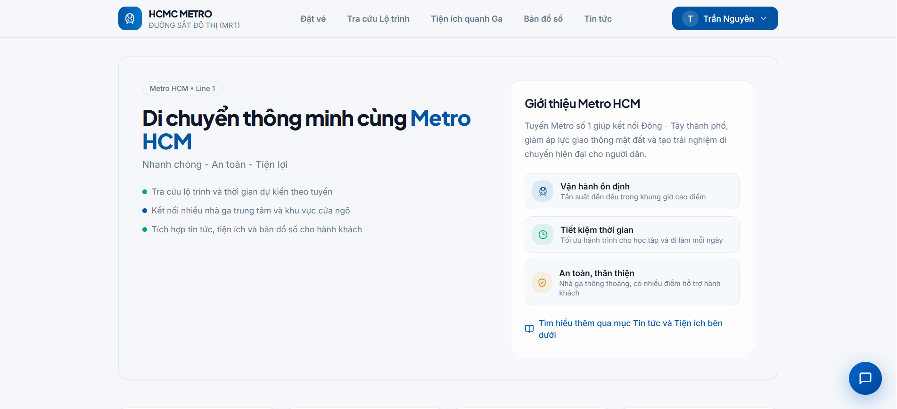
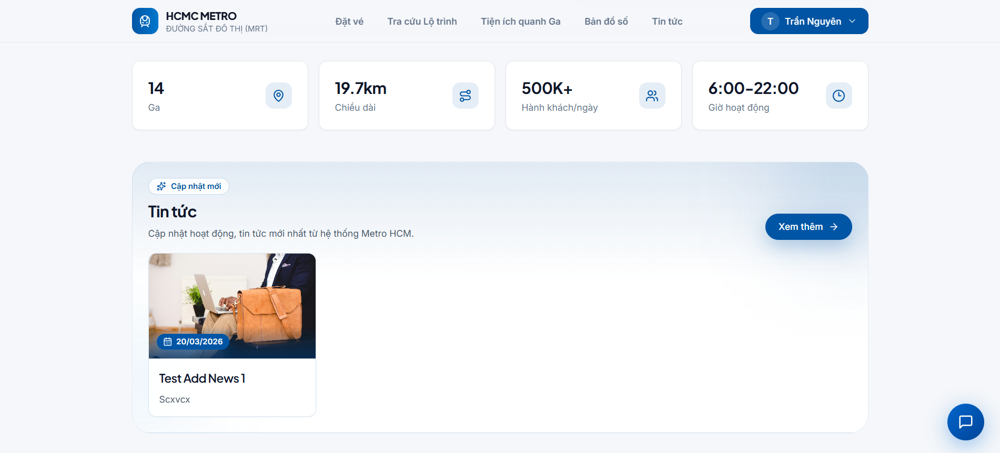
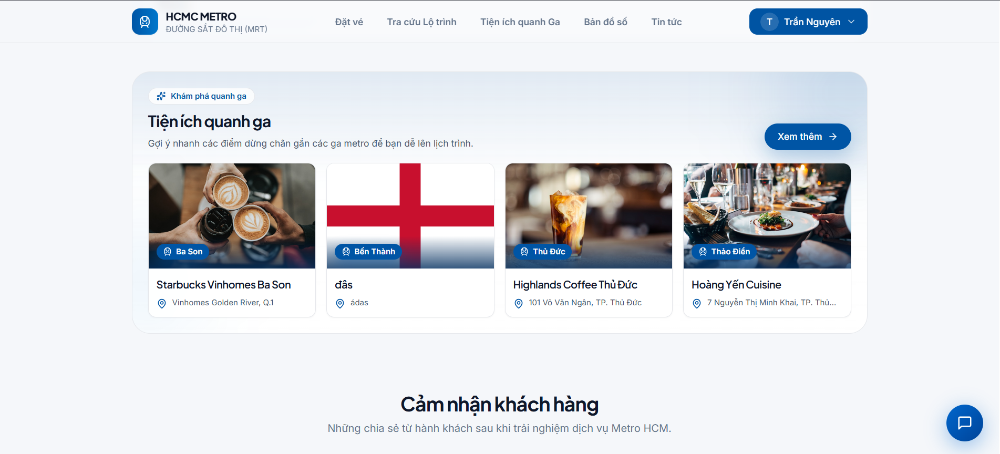
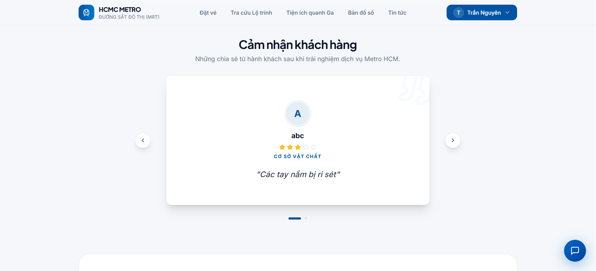
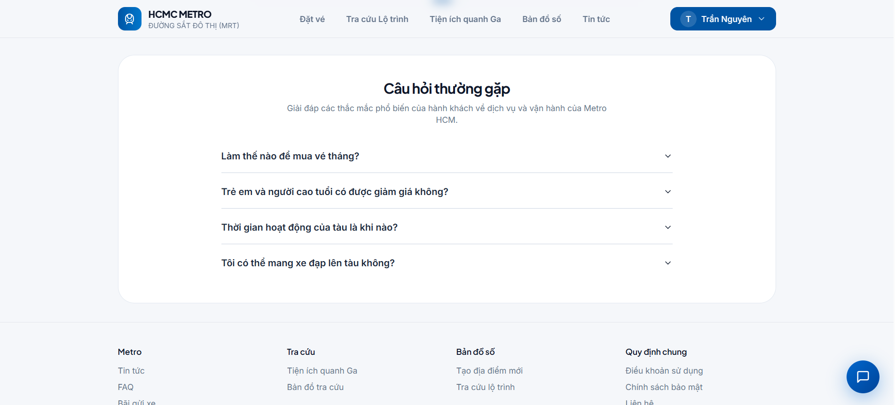

- **Bản đồ số Metro:**
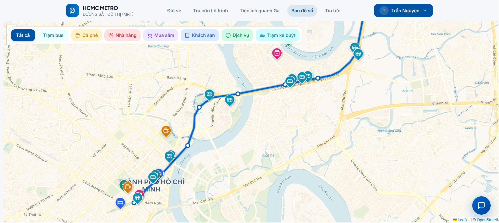

- **Tra cứu lộ trình & ga Metro:**
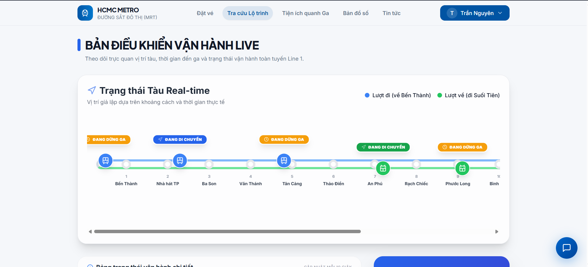
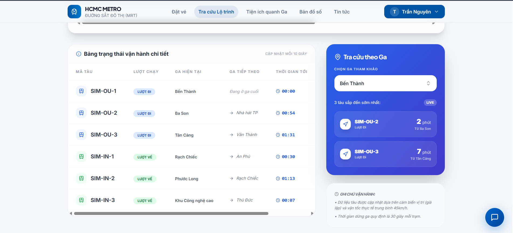
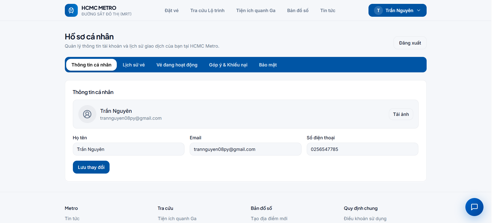

- **Tiện ích quanh Ga:**
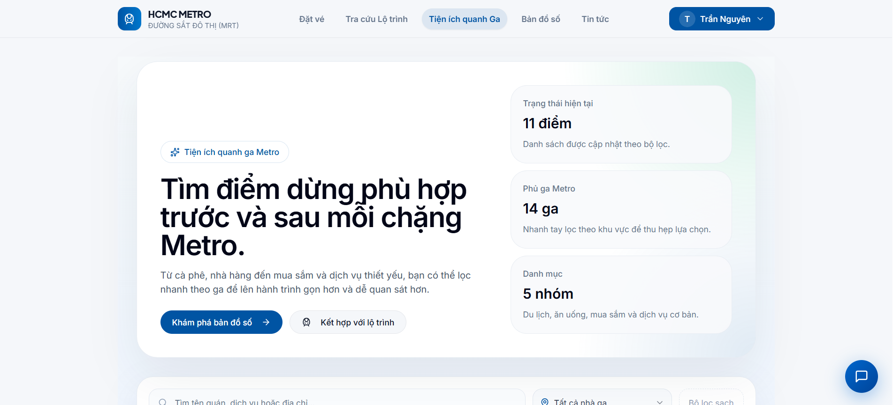
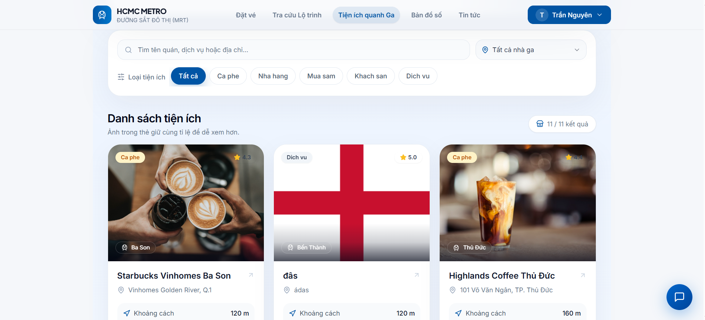
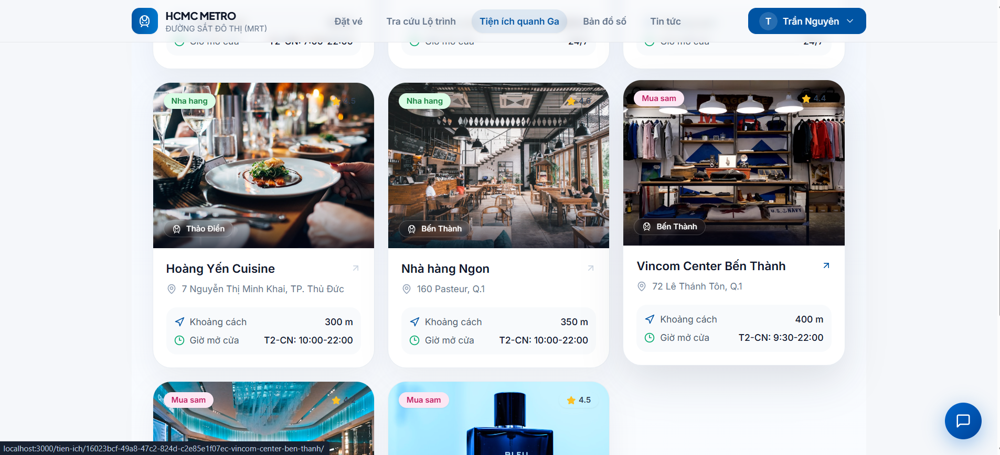

- **Quy trình đặt vé & thanh toán:**
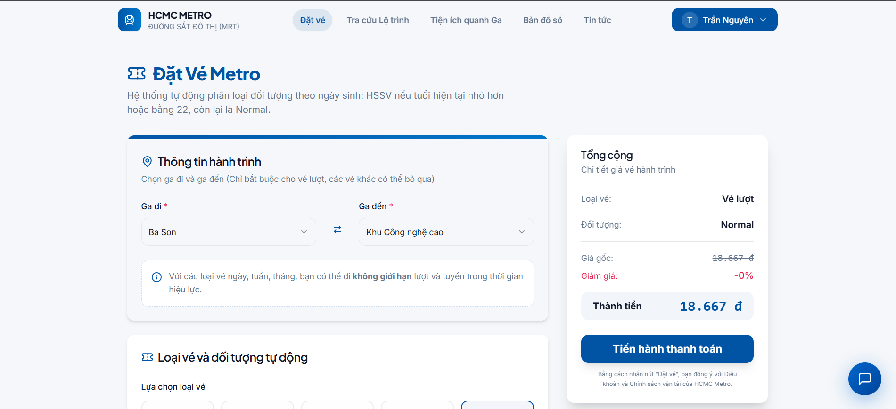
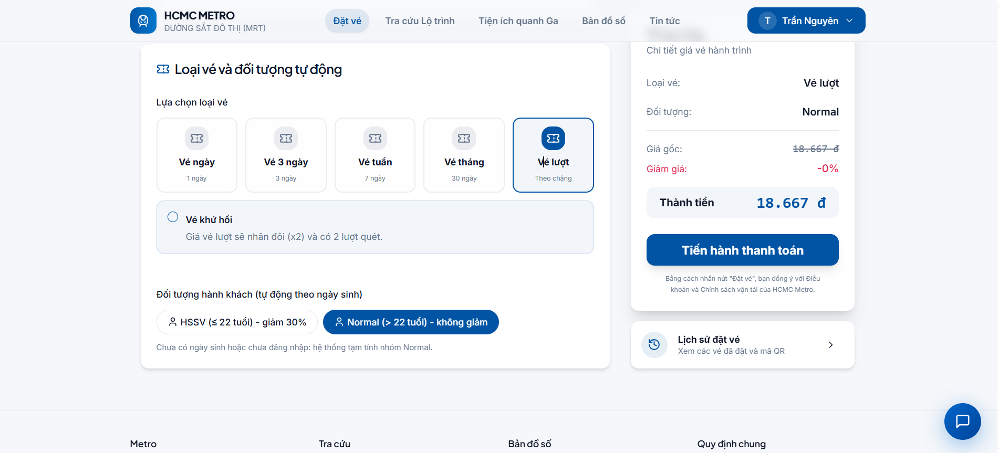
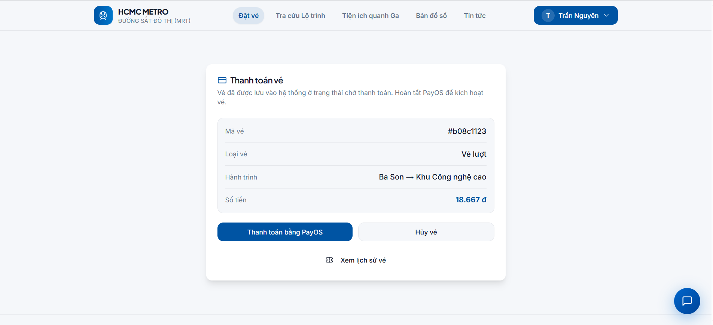
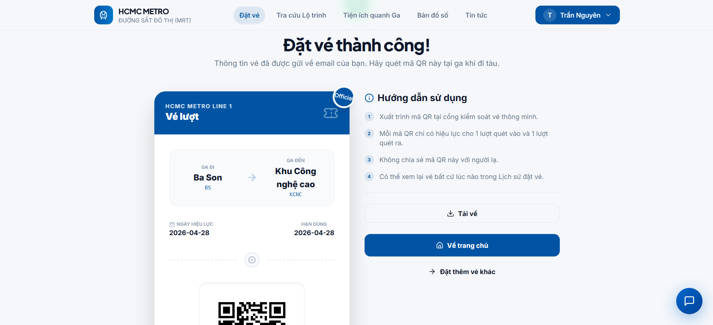

- **Trang cá nhân & quản lý vé:**
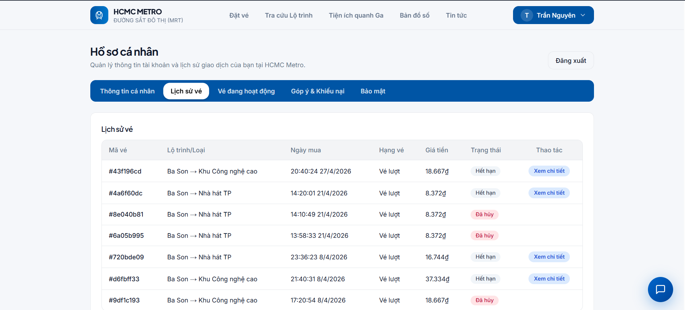
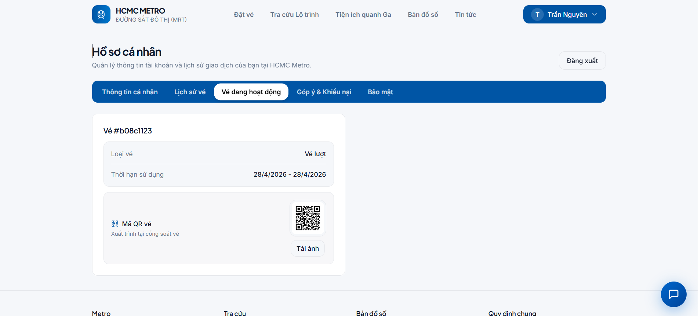
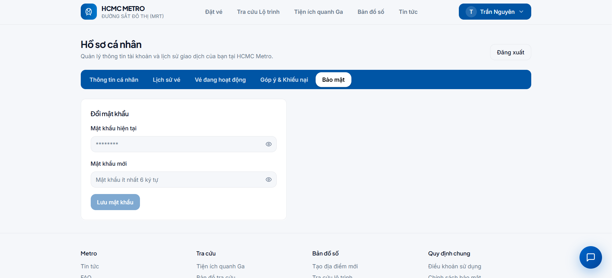
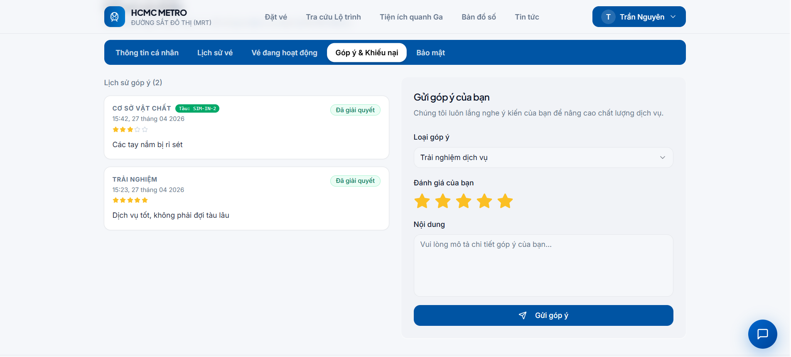
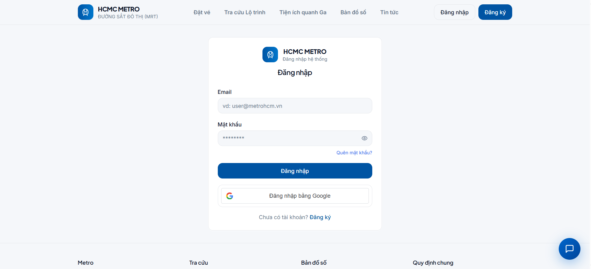
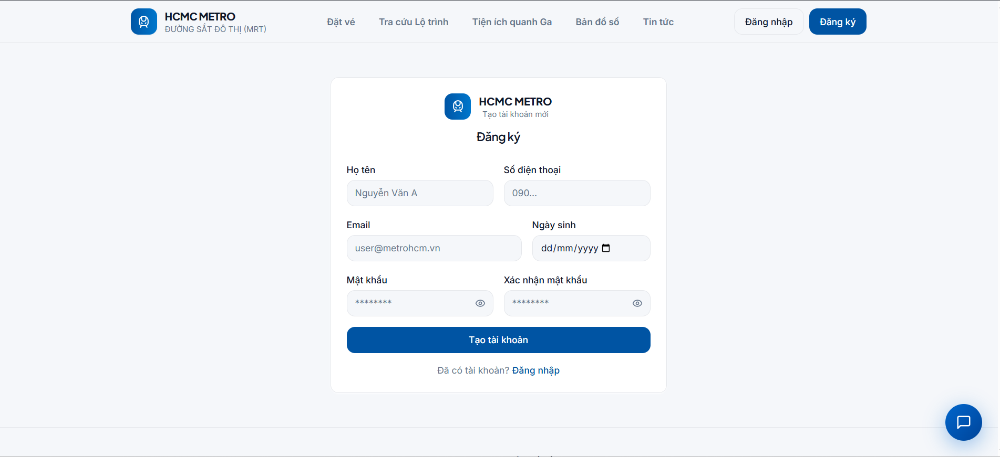

